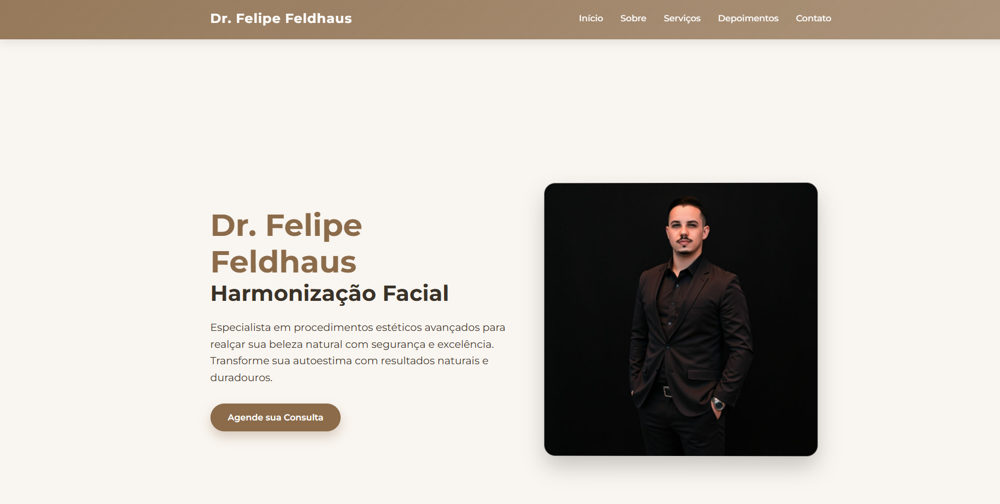
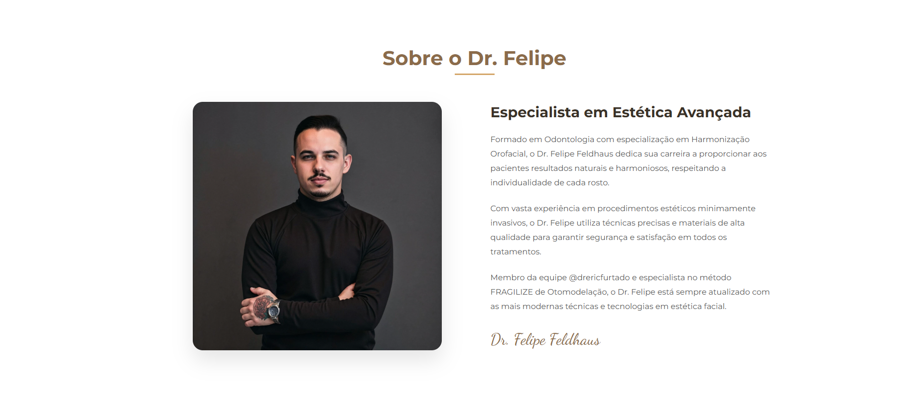

# Meu Primeiro Freelancer: Site para o Consultório do Dr. Felipe Feldhaus 

Esse projeto marcou o início da minha trajetória como desenvolvedor web freelancer! 🚀  
Fui responsável por criar o site institucional do **Dr. Felipe Feldhaus**, especialista em estética facial e harmonização avançada.

O desafio era criar uma página **leve**, **moderna** e **responsiva**, usando apenas **HTML5** e **CSS3 puro**, sem o uso de frameworks. O resultado foi um site elegante e profissional para o consultório.

---

## 🌐 Link para o site publicado:

👉 [https://drfelipefeldhaus.netlify.app/](https://drfelipefeldhaus.netlify.app/)

---

## 👨‍⚕️ Sobre o Cliente:

O **Dr. Felipe Feldhaus** é especialista em **Harmonização Orofacial**, com consultório próprio e foco em procedimentos estéticos avançados para realçar a beleza natural dos pacientes.

📸 Instagram profissional:  
[https://www.instagram.com/dr.felipefeldhaus](https://www.instagram.com/dr.felipefeldhaus)

---

## 🛠️ Tecnologias utilizadas:

- ✅ HTML5
- ✅ CSS3 (puro)
- ✅ Design Responsivo (Desktop, Tablet e Mobile)
- ✅ Deploy no **Netlify**

---

## 📌 Principais funcionalidades e seções:

- **🔔 Home:** Chamada de destaque com botão para agendamento.
- **👨‍⚕️ Sobre o Doutor:** Formação, experiência e trajetória do profissional.
- **📝 Serviços:** Lista de procedimentos oferecidos no consultório.
- **💬 Depoimentos:** Feedbacks de pacientes (com layout de destaque).
- **📞 Contato:** Botão direto para WhatsApp e informações para agendamento.

---

## 📷 Prints do projeto:

### Página Inicial:

### Sobre o Dr. Felipe:

*(Imagens demonstrativas - Capturas de tela do projeto publicado)*

---

## 🚀 Meu aprendizado com esse projeto:

✅ Atendimento ao cliente real  
✅ Entrega de um site profissional do zero  
✅ Prática de responsividade  
✅ Organização de código limpo e estruturado  
✅ Deploy gratuito usando o **Netlify**

---

## ✅ Status do Projeto:

> Projeto concluído, entregue e publicado com sucesso ✅

---

## 🙋‍♂️ Desenvolvido por:

**Guilherme dos Santos Neto**

Se quiser ver mais projetos, me siga por aqui ou entre em contato!  
